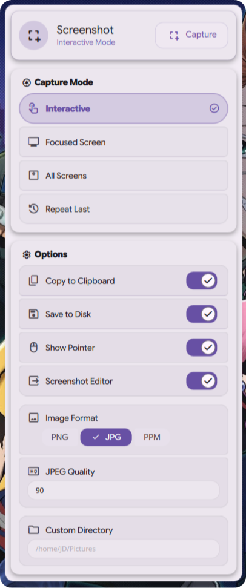
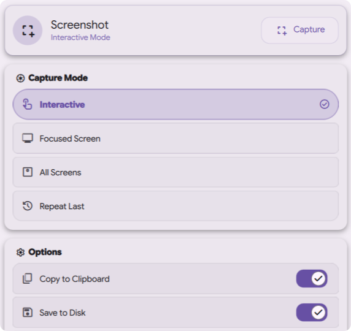
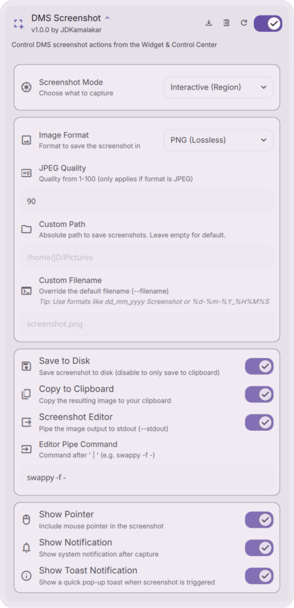

# [DMS_Screenshot](#)

### Premium Screen Capture
Integrated screenshot utility for Dank Material Shell – capture your workflow with precision and style.

## Download

*Requires Dank Material Shell (DMS) 1.0 or higher.*

## Features

* **Area Selection**: Capture specific parts of your screen with a simple drag-and-drop.
* **Full Desktop**: Snap your entire workspace across all monitors instantly.
* **Smart Snapping**: Quickly capture specific application windows with precision.
* **Material Aesthetics**: Smooth animations and transitions that feel native to DMS.
* **Integrated Workflow**: Automatically save to disk, copy to clipboard, or pipe to an editor.
* **Filename Templates**: Insert date and time tokens like `%Y`, `%m`, `%d`, `%H`, `%M`, `%S` directly into custom paths and filenames.
* **Capture Delay**: Optional countdown of 3, 5, or 10 seconds before the shutter fires for non-interactive modes.
* **Deep Settings**: Full control over output format, quality, and notification behavior.

## Interface

  
  

## Configuration

  

## Contributing

Pull requests are welcome. For major changes, please open an issue first to discuss what you would like to change.

Before reporting a new issue, take a look at the [FAQ](https://github.com/JDKamalakar/DMS-Screenshot/wiki), the [changelog](https://github.com/JDKamalakar/DMS-Screenshot/releases) and the already opened [issues](https://github.com/JDKamalakar/DMS-Screenshot/issues).

### Credits

Built with ❤️ for the [Dank Material Shell](https://github.com/DankMaterialShell) community.

### Disclaimer

This application is an independent utility for Dank Material Shell.

### 📜 License

Part of DankMaterialShell. Check the main repository for license information.

