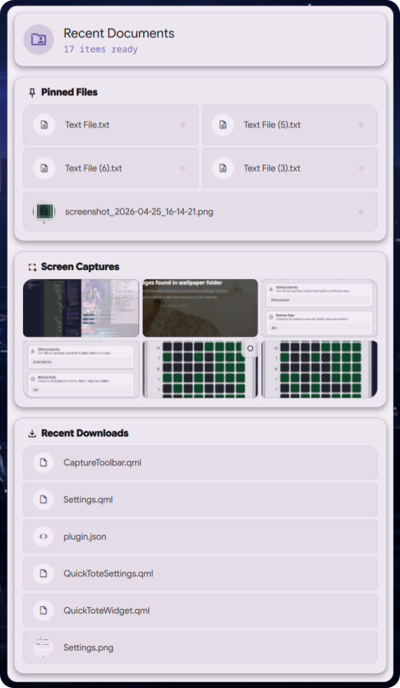
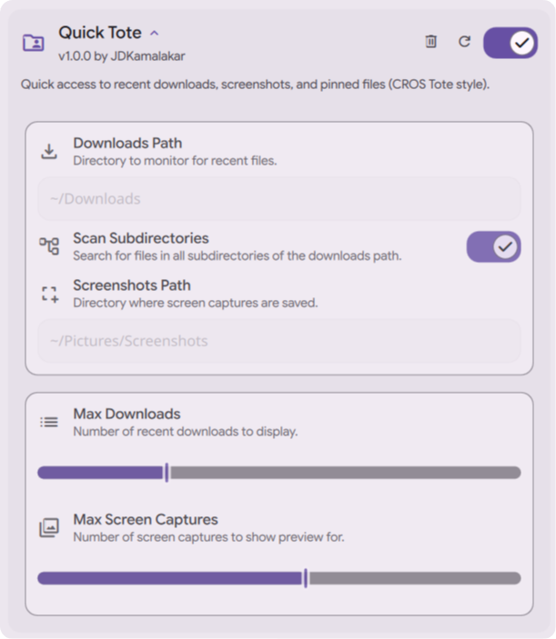

# [DMS-Quick_Tote](#)

### Productivity Hub
High-productivity file access hub for Dank Material Shell – pin, track, and share with effortless efficiency.

## Download

*Requires Dank Material Shell (DMS) 1.0 or higher.*

## Features

* **Pinned Files**: Manually pin your most frequently used documents or folders for permanent one-click access.
* **Recent Downloads**: Automatically monitors your downloads folder to display the latest files you've grabbed.
* **Screen Captures**: Instant preview and access to your most recent screenshots.
* **Drag & Drop Support**: Move files directly from the Tote into any application for instantaneous sharing.
* **Material Aesthetics**: Fluid animations, glassmorphism effects, and a responsive layout native to DMS.
* **Configurable Limits**: Full control over how many items are visible in each section via the settings panel.

## Interface

  

## Configuration

  

## Contributing

Pull requests are welcome. For major changes, please open an issue first to discuss what you would like to change.

Before reporting a new issue, take a look at the [FAQ](https://github.com/JDKamalakar/DMS-Quick_Tote/wiki), the [changelog](https://github.com/JDKamalakar/DMS-Quick_Tote/releases) and the already opened [issues](https://github.com/JDKamalakar/DMS-Quick_Tote/issues).

### Credits

Built with ❤️ for the [Dank Material Shell](https://github.com/DankMaterialShell) community.

### Disclaimer

This application is an independent utility for Dank Material Shell.

### 📜 License

Part of DankMaterialShell. Check the main repository for license information.

