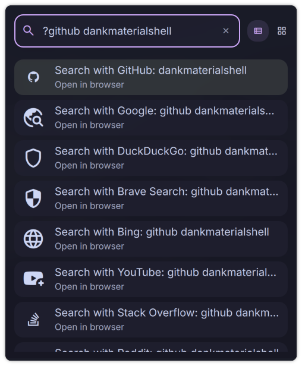

# Web Search

A DankMaterialShell launcher plugin for searching the web with 23+ built-in search engines and support for custom search engines.



## Features

- **23+ Built-in Search Engines** - Google, DuckDuckGo, GitHub, Stack Overflow, and more
- **DuckDuckGo !Bangs Support** - Support for 13,000+ !bang shortcuts
- **Enable/Disable Engines** - Toggle individual search engines on/off to reduce clutter
- **Custom Search Engines** - Add your own search engines with URL templates
- **Keyword-Based Selection** - Type keywords to use specific engines (e.g., `github rust`)
- **Configurable Default Engine** - Set any engine (built-in or custom) as default
- **One-Click Search** - Select and press Enter to open browser
- **Toast Notifications** - Visual feedback for every search
- **Configurable Trigger** - Default `@` or set your own trigger

## Installation

### From Plugin Registry (Recommended)

```bash
dms plugins install webSearch
```

### Manual Installation

```bash
# Copy plugin to DMS plugins directory
cp -r WebSearch ~/.config/DankMaterialShell/plugins/

# Enable in DMS
# 1. Open Settings (Ctrl+,)
# 2. Go to Plugins tab
# 3. Click "Scan for Plugins"
# 4. Toggle "Web Search" to enable
```

## Usage

### Basic Search

Note: Avoid triggers reserved by DMS or other plugins (e.g., `/` is used for file search).

1. Open launcher (Ctrl+Space)
2. Type `@` followed by search query
3. Examples:
   - `@ rust tutorials` - Search with default engine
   - `@ linux kernel` - General search
4. Select engine and press Enter to open browser

### Engine-Specific Search

Use keywords to search specific engines directly:

- `@ github awesome-linux` - Search GitHub
- `@ youtube music video` - Search YouTube
- `@ wiki quantum physics` - Search Wikipedia
- `@ stackoverflow async rust` - Search Stack Overflow

If a custom engine and a built-in engine share the same keyword, the custom engine takes priority.
When multiple engines share the matched keyword, they are grouped at the top of results before other engines.

## Built-in Search Engines

### General Search

- **Google** - Keywords: `google`, `search`
- **DuckDuckGo** - Keywords: `ddg`, `duckduckgo`, `privacy`, `search`
- **Brave Search** - Keywords: `brave`, `privacy`, `search`
- **Bing** - Keywords: `bing`, `microsoft`, `search`
- **Kagi** - Keywords: `kagi`, `privacy`, `search`

### Development

- **GitHub** - Keywords: `github`, `code`, `git`
- **Stack Overflow** - Keywords: `stackoverflow`, `stack`, `coding`, `so`
- **npm** - Keywords: `npm`, `node`, `javascript`
- **PyPI** - Keywords: `pypi`, `python`, `pip`
- **crates.io** - Keywords: `crates`, `rust`, `cargo`
- **MDN Web Docs** - Keywords: `mdn`, `mozilla`, `web`, `docs`

### Linux & Packages

- **Arch Linux Wiki** - Keywords: `arch`, `archwiki`, `linux`, `wiki`
- **AUR** - Keywords: `aur`, `arch`, `packages`
- **Nix Packages** - Keywords: `nixpkgs`, `pkgs`, `nix`, `nixos`, `packages`
- **NixOS Options** - Keywords: `nixopts`, `opts`, `nixos`, `options`

### Social & Media

- **YouTube** - Keywords: `youtube`, `video`, `yt`
- **Reddit** - Keywords: `reddit`, `social`
- **Twitter/X** - Keywords: `twitter`, `x`, `social`
- **LinkedIn** - Keywords: `linkedin`, `job`, `professional`, `social`

### Reference

- **Wikipedia** - Keywords: `wikipedia`, `wiki`
- **Google Translate** - Keywords: `translate`, `translation`
- **IMDb** - Keywords: `imdb`, `movies`, `tv`

### Shopping

- **Amazon** - Keywords: `amazon`, `shop`, `shopping`
- **eBay** - Keywords: `ebay`, `shop`, `shopping`, `auction`

### Utilities

- **Google Maps** - Keywords: `maps`, `map`, `location`, `directions`
- **Google Images** - Keywords: `images`, `image`, `img`, `pictures`, `photos`

## Custom Search Engines

Add your own search engines via Settings:

1. Open Settings → Plugins → Web Search
2. Scroll to "Custom Search Engines"
3. Fill in the form:
   - **ID**: Unique identifier (e.g., `myengine`)
   - **Name**: Display name (e.g., `My Search Engine`)
   - **Icon**: Material icon name (e.g., `search`), prefix with `material:` to pull a Material Symbol (e.g., `material:travel_explore`), or prefix with `unicode:` to use emoji/Nerd Font glyphs (e.g., `unicode:`)
   - **URL**: Search URL with `%s` placeholder
   - **Keywords**: Comma-separated keywords for quick access

### Example Custom Engines

**Rust Documentation:**

```
ID: rustdoc
Name: Rust Docs
Icon: unicode:🦀
URL: https://doc.rust-lang.org/std/?search=%s
Keywords: rust,docs,documentation
```

**Arch Wiki:**

```
ID: archwiki
Name: Arch Wiki
Icon: material:menu_book
URL: https://wiki.archlinux.org/index.php?search=%s
Keywords: arch,wiki,documentation
```

**GitLab:**

```
ID: gitlab
Name: GitLab
Icon: material:code
URL: https://gitlab.com/search?search=%s
Keywords: gitlab,code
```

## DuckDuckGo !Bangs

The plugin now supports DuckDuckGo's massive library of over 13,000 "!bang" shortcuts. This allows you to search almost any site on the web directly from your launcher without needing to manually add them as custom engines.

### Setup

1. Open **Settings** → **Plugins** → **Web Search**.
2. Click **"Sync Now"** in the DuckDuckGo Bangs section to download the latest bang database.
3. Once synced, you're ready to go!

### Usage

Simply type `!` followed by the bang trigger and your search query:

- `!w quantum physics` - Search Wikipedia
- `!g dms-web-search` - Search Google
- `!gh dms-plugins` - Search GitHub
- `!yt rust tutorial` - Search YouTube

The plugin will provide instant suggestions for matching bangs as you type. Searches are performed client-side, bypassing DuckDuckGo's redirect for faster results.

## Configuration

Access settings via DMS Settings → Plugins → Web Search:

- **Trigger**: Set custom trigger (`@`, `!`, `ws`, etc.) or disable for always-on mode
  - Avoid triggers reserved by DMS or other plugins (e.g., `/` is used for file search).
- **Default Search Engine**: Choose your preferred engine from all available engines (built-in and custom)
- **Enable/Disable Engines**: Toggle individual search engines on/off to reduce clutter
- **Custom Search Engines**: Add/manage your own search engines

## Requirements

- DankMaterialShell >= 0.1.0
- Web browser (default system browser via `xdg-open`)
- Wayland compositor

## Contributing

Want to add more built-in search engines? Open an issue or submit a pull request!

## License

MIT License - See LICENSE file for details

## Author

Created for the DankMaterialShell community

## Links

- [DankMaterialShell](https://github.com/AvengeMedia/DankMaterialShell)
- [Plugin Registry](https://github.com/AvengeMedia/dms-plugin-registry)
